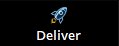

# Sample Project Guide

We have put together a sample project to showcase what can be created during Livewires online, and hopefully help inspire your own 1-minute trailer you will make during the week.
[You can download and watch the sample trailer here](TempLinks.md)

### Using the Sample Project

When Davinci Resolve opens, a 'project manager' window should open. Like this:

If you don't see this, then in the bottom right-hand corner of Resolve, there should be a small icon of a house. Click this and the project manager will open.

In the project manager, right-click an empty space and select ‘import project’.
Find the folder you downloaded during setup, and import the Davinci Resolve file named: ‘LW2020-AdvVideo_sample-project.drp’:

Once you open the project, Resolve might tell you that there are ‘offline’ clips. If so, you will need to ‘relink’ the clips. To do this, right click the folder ‘scenes’ and select ‘Relink Clips for Selected Bins...’

Then, in the file explorer window Resolve opens, find the folder ‘scenes’ in the advanced video folders (livewires-2020_advanced-video > files > spring > scenes )
Repeat this for any other files by selecting the individual file/ media/ clip, right-click and select the option ‘Relink Selected clips...’

Open the main timeline named: ‘spring-trailer’ and play around! If you have no idea what you’re doing in Davinci Resolve at the moment, then do not fear! Explore the following  few pages to get a quick run-through to get started. We will be guiding you through in more detail during the livewires online week tech sessions.

# Davinci Resolve Quick-Start Guide
This is a quick introductory guide for using Davinci Resolve, to help you explore the software before the start of Livewires. Over the Livewires week, you will be learning a lot more about using Davinci Resolve and editing.

### The Panels.
Davinci Resolve is made up of 7 panels...

... to simulate and support the editing workflow, from importing media in the ‘Media’ panel to final renders in the ‘Deliver’ panel. You will see these 7 panels along the dark bar hooked to the bottom of the window, showing icons that you probably won’t quite understand ye. To help you get to know the icons, you can right-click the bar and select the ‘.................’ option, to reveal the names of each panel.

###### Media Panel: -- 
This is where you import your media, with easy access to your drives for locating and importing your media by clicking and dragging from there into the ‘Media Pool’ window.
Davinci Resolve uses these different windows to organise different tools. You can simply click on the text ‘Media Pool’ to close this window and click on another window name to open or close them also.
You will only really need the media panel at the start of the edit workflow because you can still import media later on, through the windows named Media pools.

###### Cut Panel: -- 
This is where you do initial cutting, scanning and watching through your imported media and slicing out all the unnecessary bits when you go to edit.
The panel has a timeline, however it is not your main editing timeline (that comes next, in the ‘Edit’ panel) but this timeline is connected to the other timelines in other panels, and you can use this to quickly piece together a video that you will later refine in the next panel.

###### Edit Panel: -- 
This is your main editing station, and where you will be spending most of your time while creating the video. You can import media from the Media pool window, explore the ‘Metadata’, giving you information/ data about the file, and ‘Inspector’, that allows you to edit the attributes of the footage (including: Position, rotation and other effects) when you select a clip.
To move media into the timeline, simply click on it in the Media pool and drag, with your mouse, over towards the timeline.
Brief Overview of the Timeline:
The timeline is comprised of channels for video (V1, V2, V3...) and audio (A1, A2...). The video channels act like layers, and when videos are stacked on top of one another, it will be the very top or highest video that will be seen. However, with the audio channels, all the audio is played no matter their positioning vertically, across the channels. For now we can call them video layers and audio channels.

###### Fusion Panel (Graphics): -- 
This panel is unique to Davinci Resolve, but other software have similar systems with different names. This allows for advanced control over the footage, graphics and colour inputs of your project by using, what are known as, 'Nodes'. We won’t get into the details of it here or during Livewires, however, the basis of it are, dynamic boxes that allow for other boxes to connect to them as inputs or outputs - so, for example,

###### Fairlight Panel (Audio): -- 
While you can do audio editing in the edit panel, this is a specific panel for advanced editing and very specific audio edits.
This is much like the edit panel, with a timeline and video preview window but it now has a section on the left for audio controls. You can take one of these, for instance the ‘......’ and click and drag it onto a clip. You then use the ‘Inspector’ window to edit this ‘effect’ that will do a specific thing to your audio. I won’t be explaining them all in detail and what they do now, but you can use this time to experiment with all the different effects and controls.

###### Color Panel: -- 
Now, this panel may look very frightening at first, but don't worry! You won't need to understand everything that is going on here to edit your trailer.
Imagine it like the filters in a phone's camera or on Instagram. But, what this panel offers is far more advanced control over the look and feel of the footage - in short, custom filters - except that the footage you will be editing with has already been through a workflow similar to this for editing colour.
All you need to know for this, is that you can use the controls to take flat images and boost them by:
* Darkening the blacks and brightening the whites
* Adjusting contrast (the difference between the light and dark parts)
* Saturating or de-saturating the footage (increasing the colour intensity)
To do all this, you must select a clip from the timeline on the panel, then use the settings in this window:
Without delving into the complexities of Colour theory, you can experiment with all the different tools to see what effect it creates!

###### Deliver Panel: -- 
The final panel of the seven, this is where you will render your video—adjusting settings that we will go into detail in the final session of advanced video at Livewires. For now, this panel will be of little use to you until you have a video to render with.
If you would like to try rendering, then render the sample project and explore the settings already set there. Bear in mind that it will take longer to render on a slower machine.
