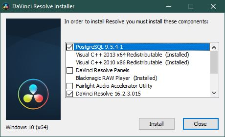
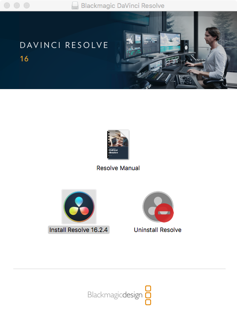
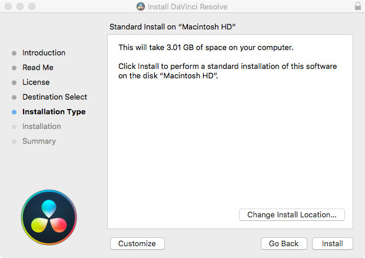
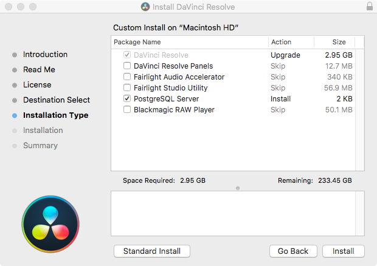

# DaVinci Resolve Setup Guide

Before the start of Livewires, you will need to download some files containing everything you'll need for the week.

### IMPORTANT STEPS:

 1. [Install the software](#Installation)

 2. [Choose a Film](#Choosing-a-Film)

# Installation

Download DaVinci Resolve by clicking one of these links:

[Windows Users](onedrive.com)

[Mac OS Users](onedrive.com)

And follow one of the guides below to install the download on your operating system: [Windows](#for-windows-7-8--10-users) or [Mac OS](#for-mac-os-users)

## For WINDOWS 7, 8 & 10 Users
1. Extract (unzip) the file we provided (Right click > Extract All). This contains the DaVinci Resolve installer.

2. Locate the installer and open it by double-clicking... (DaVinci_Resolve_16.2.3_Windows.exe)

3. Once the installer is open, tick these options:
* PostgreSQL
* DaVinci Resolve 16...
###### Untick any boxes not in this list (you may have to scroll-down to see all the options).

4. Continue following the installer instructions, clicking 'Next' where needed.
* Accept the License Agreement (agreeing to use the software appropriately)
* Then finish and exit the installer.

5. Now, find and open DaVinci Resolve.
* A ‘Firewall’ window notification will pop-up - when it does, accept each window and Resolve will continue opening.
###### You may find it takes a little while to open, but it will open and isn't frozen on 'Looking for Control Surface' - so be patient.
* Once Resolve is open, it may ask you if you wish to update the software. Ignore this by pressing ‘skip’.

DaVinci Resolve should now be setup and ready for you to edit with! Go to the next page to begin learning how to use the Sample Project while you anxiously wait for Livewires to begin! [Sample Project Guide](SampleProjectGuide.md)

## For MAC OS Users
1. Double-click the .zip file we provided and wait for it to extract. This contains the DaVinci Resolve installer.

2. Locate the DaVinci Resolve .zip file (DaVinci_Resolve_16.2.4_Mac.zip) and double-click it. Wait for it to extract.
* Once it has finished extracting, there will now be a new file (DaVinci_Resolve_16.2.4_Mac.dmg). Double-click that as well.

4. A window will now popup. Double-click on 'Install Resolve 16.2.4'

A new window will popup. Follow the steps by pressing 'Continue' and agree to the License Agreement (agreeing to use the software appropriately).

5. At this screen, hit 'Customize':

And make sure these options are ticked:
* DaVinci Resolve (This will be ticked already)
* PostgreSQL Server
###### Untick any boxes not in this list.

6. Click install and type in your Mac's admin login or ask someone who knows it.
* Once installed, find and open DaVinci Resolve (Check the far end of the Launchpad)
###### You may find it takes a little while to open, but it will open and isn't frozen on 'Looking for Control Surface' - so be patient.

DaVinci Resolve should now be setup and ready for you to edit with! Go to the next page to begin learning how to use the Sample Project while you anxiously wait for Livewires to begin! [Sample Project Guide](SampleProjectGuide.md)

# Choosing a Film

You will need to decide which of these films you want to try to make a trailer out of. You can watch any of the following films by clicking the thumbnails below or by locating them in the folder '**video**' in each film's folder, within your livewires package (e.g. **files > spring > video > spring_blender-film536p.mp4**).

###### Each film has a difficulty rating next to it, because it becomes more difficult the longer the film is to create the trailer, especially in the time period of Livewires. And the difficulty of the editing increases with the different files available.

## ***"Hero" (4-minutes)***
###### LOW
What the file contains:
- Audio: Full Musical Score
- Scenes - Broken down to each cut.
- Video: Final film.
- Project file.

Download the files: [Hero](onedrive.com)

## ***"Caminandes" Films (6-minutes)***
###### LOW
What the file contains:
- Audio: Full Musical Score
- Scenes - Broken down to each cut.
- Video: Final film.
- Project file.

Download the files: [Caminandes 1-3](onedrive.com)

## ***"Spring" (8-minutes)***
###### MEDIUM
What the file contains:
- Audio: Full sound-effects, no music.
- Scenes - Broken down to each cut.
- Video: Final film.
- Project file.

Download the files: [Spring](onedrive.com)

## ***"Big Buck Bunny" (10-minutes)***
###### HIGH
What the file contains:
- Scenes - Broken down to each cut.
- Video: Final film.
- Project file.

Download the files: [Big Buck Bunny](onedrive.com)

Once you have chosen which of these films you would like to edit with, you will need to download the files for them.
