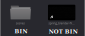

# Film Trailer Guide

To proceed with the worksheets you should have completed the [Setup Guide](../SetupGuide.md) and must wait till the start of the Livewires 2021 week, but please take a look now if you wish to!

## Importing a Template Project.

At this point you should have been through the [SetupGuide](SetupGuide.md) [Sample Project Guide](../SampleProjectGuide.md), as you will have learnt how to import project files into DaVinci Resolve.\
We will now do the same but instead of importing the sample project we will import a template project, from one of three Blender film folders inside your Video Production package.\
Open up the folders and go to '**files**'. In there you will find three more folders, each with a different Blender short film in them with template projects for them, ready to start editing with.\

Open up DaVinci Resolve and import the project (In Resolve: **File > Import Project...**) from the folder of your chosen film, within the Livewires package (e.g. **files > spring > template-project_spring.drp**).

The project will open and will include all the footage you will need, taken from the blender film. And in the media pool you will see several things: Bins (folders), the timeline and other footage.
Once open, if the footage in any of the bins say ‘Offline’, then simply right-click the bins, in the 'media pool', and select the option ‘Relink Clips for Selected Bin...’ then find the folder with the same name (e.g. 'video' or 'scenes') in the folder for the film that you chose. **Don't open the folder**, just click on it and select 'Open' or 'Import' (Find more info on this process in the [Sample Project Guide, steps 3-5](../SampleProjectGuide.md)

Press Ctrl+S to save your project to your computer (or find the menu item: File > Save Project ). If it prompts for a name, just type in the name you would like to give to your project (e.g. 'spring-trailer').
###### This will be saved to the DaVinci Resolve project storage database on your computer.

## Contents of the Film Trailer Worksheet guides

1. [Editing Video](01-EditingVideo.md)
    * Creating a Film Trailer
    * The Art of Editing
      * Basic Editing Techniques
    * Transitions
    * Adding Titles and Graphics
    * Colour Editing
    * Challenge
2. [Editing Audio](02-EditingAudio.md)
    * The Fairlight Panel
      * Dealing With the Audio Difficulties
      * Audio FX - 'Fairlight FX
    * Challenge
3. [Rendering](03-Rendering.md)
    * The Deliver panel
      * What is Rendering?
      * Render Settings
        * Video
        * Audio
        * File
      * How To Render in Resolve
    * Challenge

###### If ever you want more detailed information about DaVinci Resolve, there is a reference manual (while very long) that you can find in the Menu: **Help > DaVinci Resolve Reference Manual**

## Challenge

On each page, we will set you a little challenge, alongside the main worksheet and tech sessions, to support your learning and to help you improve your videos! There will be three main pages/ worksheets and three challenges.

## Checklist
At this point you should have completed these key steps...

- [X] Installed DaVinci Resolve
- [X] Chosen a blender film
- [X] Imported the blender film template project into Resolve

---

-> Next page: [Editing Video](01-EditingVideo.md)

[X] Home Page: [Livewires Video Production](../README.md)
