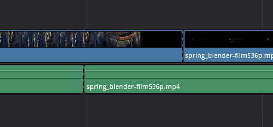
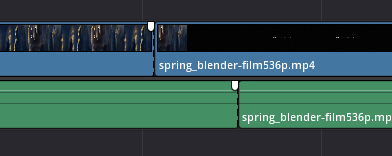

# Editing Video

This page will cover you for most of the Livewires video production sessions, with the following 2 pages there for the last half of the final session and for you to take away with you.

## Creating a Film Trailer

It is up to you how you proceed with making the trailer. You can do anything with the footage we provided, even add in new footage. You could make the film appear as an entirely different genre, for instance, an Action film turned Romantic-Comedy - so have some fun!
Below we have summarised a useful, generic workflow for editing your trailer, starting with the basic formation and outline of the video.

1. **Watch the film (if you have already: a second watch wouldn't hurt!) and start making notes.** Start asking yourself, what sort of trailer do you want to create? How could you create a short narrative from the footage of this film?
  * Navigating the timeline:
    * Ctrl+ScrollWheel (+ / -) =  Scroll up the timeline, in Video section and Audio section
    * Alt+ScrollWheel (+ / -) = Zoom into the whole timeline.
    * MiddleMouseButton (Down/ Click+Drag) = Move across the timeline.

2. **Create your Narrative: Search through clips and piece together a rough trailer idea.** Look through the footage in the template project and begin to piece together small parts of your trailer, trying out different order of edits and how they flow into one another.
Hopefully by now you've had a quick read through the [Sample Project Guide](../SampleProjectGuide.md) and had a play around in DaVinci Resolve. Here we'll go into detail of the 'Edit' panel and using the Timeline:
  * Use the space-bar to play the timeline.
  * In the Media Pool, you can scan through media by hovering your cursor, and running it across the footage.
  * You can also click on the media and view it in the player on the left of the timeline player.
  * Drag clips from the media pool into the timeline.

3. **Experiment and discover what works best** Don't feel you have to work with the narrative already there in the films, take them and morph them as you wish - create whole new narratives, that are shortened into 1-minute.
You could quickly piece together small sections, trying out several ideas to gradually work out your narrative.

4. **Decide on the ending first.** Something that I found useful, when editing the 'Spring' trailer, was to edit an ending section of trailer first, to get a feel for where the trailer and narrative could head. I had an initial edit for the ending, that I did later changed, but doing it helped push the editing and my ideas further and in a focused direction.

5. **The difficulty of audio and how to fix it.** With the way we have processed the Blender films (by slicing each cut of the final films) the audio will be a bit of a mess and, because of what was spoken about in 'Basic Editing Techniques' before, audio is useful for smoothing transitions and so, in the 'Spring' film, there are many cuts that rely on a build up in the music or sound to hide cuts or make them less jarring. Causing sudden audio cut-outs or sound-effects that are cut-short.
*We will go into greater depth for fixing this in the [next page](02-EditingAudio.md)*
To make this audio feel more whole, when editing, you can use simple tricks like piecing together the clips in order or using the audio from the blender video.

6. **Adding in more footage, music or graphics.** If you want to add in new media into Resolve, double-click or right-click the Media Pool area and select 'Import Media...'

## The Art of Editing

Editing is an art, but one of the more technically grounded arts. In-fact, it started out in the early 1900s as merely there as the stage of piecing together what has been filmed without removing much or any creativity involved. However, since then, it has become more widely known for its creativity and taken to new levels. The key to editing, and what has been found to work best, is telling a coherent story or narrative that can be followed by the audience but not all rules are set in stone, they must change with time as people and cultures change and so the way people process information and feelings changes; because editing is just playing with feeling, and how audiences will feel when watching the film. And successful editing provokes the feeling in the audiences that editors or directors intended for.

* Basic Editing Techniques.
*Note: These are not rules and don't have to be used if you wish to provoke a different feeling, to what these techniques provoke.*
  * **The 'J' and 'L' cuts.** Referring to the position of the video clips relative to the audio clips in the timeline.
    * The 'J' cut is where the audio starts before the video, like the curve of the 'J' goes before the straight, vertical line; creating a smooth transition between cuts, making them less jarring.

    

    * The 'L' cut is where the audio continues after the video has finished and new visuals appear, still hearing the audio of the previous clip.

    

  * **Cutting on action.** As something moves on screen, or smashes down, you can hide cuts pretty well. It is found that audiences are too distracted by the action to notice or feel any jarring cut. This kind of cut is highly frequent throughout any action film, but can be found in many films to date; often can be seen when someone suddenly moves.

## Transitions

The main factor of editing the movement between cuts, shots and scenes is to make them feel seamless. Of course, there are plenty of examples that do have jarring cuts.
You can do many fancy things with transitions, from the more subtle 'Cross Dissolve', that

#### **The Basic Transitions.**
Cut / No Transition: The simple jump from one clip to the next, one after the other.
Fade-in / Fade-out: When the clip either fades into the moving image from a blank screen, or fades-out of the moving image to a blank screen. *The key is the blank screen, making it different from Cross Dissolve*
Cross Dissolve: One clip fades out as another fades in, over top of each other. Creating a ghost-like effect.
###### Check out more of these transitions with useful examples in this informative video: [Cuts & Transitions 101](https://youtube.com/watch?v=OAH0MoAv2CI)

#### **Resolve's Video Transitions.**
Dissolve.
Transition | Description
------- | -------
Additive Dissolve | Dissolves with extra frames for longer dissolve (extends the clip you have)
Blur Dissolve | Blurs the images as they transition/ dissolve
Cross Dissolve | Just dissolves between clips, with fade between.
Dip to Color Dissolve | Transitions into a colour (e.g. white, black, etc.).
Non-Additive Dissolve |
Smooth Cut | The software looks at the two footage and blends between them, misshaping the images to match.

You can also edit 'fade-ins' and 'fade-outs' on each clip by

The rest of the transitions we'll leave to you to play with. Most of them you might already know about from films like [Star Wars](https://www.youtube.com/watch?v=cGqAu9gj_F0), hah!

#### **Using These Transitions.**
To use the transitions in DaVinci Resolve, select and drag the transition, from under the 'Effects Library' window in your 'Edit' panel, onto the start or end of a clip in the timeline.
You can then adjust the length of the transition by dragging the end of the white box that appears when you drop your transition onto the clip. However, transitions use the available footage of the original clip (even if edited down) and so, it may not let you extend far because you might run out of clip or, if you can extend it, you may start revealing bits of footage you don't want seen in the edit - so watch out with that.
Now, when you select this transition, selecting that white box, and open the 'Inspector' window, you can see that you can make adjustments to this transition:
Setting | Description
------- | -------
Duration | How long the transition lasts for
Alignment | Whether the transition ends on the end of the clip; or starts at the end of the clip; or is in the middle of the two.
Video Transition Style / Audio Transition Style | Change what transition it is, so that you don't have to drag and drop a replacement.
--- | ---
Start Ratio | Where the next clip starts
End Ratio | Where the last clip ends.
Reverse (Checkbox) | Play the transition backwards
Ease | Imagine it like a straight, diagonal line from 0-100 on a graph: It stays at a constant speed, but with the 'Ease' option it can curve the line and make it go slower at the beginning and speed up ('In') or vice versa ('Out') or both ('In & Out')
Transition Curve | Where you can make a custom 'Curve' adjustment to the 'Ease' option.

## Adding Titles
In the 'Effects Library', you can also add Titles of varying positions and forms. Like the transitions you can simply click and drag one of these title pre-sets into the timeline.  
You can then adjust the text by grabbing it in the player where it appears on your video, and moving around with your mouse. You can then do more detailed adjustment by opening the 'Inspector' window where you can change many of the settings, here:

**Main Titles:**
  * Content/ Text: Type in what you want the titles to say.
  * Font: Choose from a list of fonts/ text-styles for your titles.
  * Colour: Change the text to any RGB colour.
  * Size of text: Scale of text.

**Other Settings:**
  * Drop Shadow  - *Adds shadow underneath text*
    * Blur: The scale of the shadow, or how far it spreads out.
    * Opacity: Transparency of shadow
  * Stroke - *Outline the text*
  * Background - *Add a dynamic background under the text*
    * Width & Height: Controls the background that you Make
    * Corner Radius: Set the corners to be sharp (0.00) or curved (1.00)
    * Opacity: Transparency of the background.

You can also animate the text and its settings using keyframes. By each setting you will see a diamond shape. Click this and it will go red when your timeline 'player' (the red line in the timeline) and if you move it in the timeline, you will see that the diamond shape loses it red colour.
You can now change that setting you added a keyframe to, and it will then move from your first saved setting/ keyframe to your next saved keyframe setting. You can use this to make it move positions on screen, and so much more!
*You might like to add a 'Coming Soon' screen to the end of you trailer.*

## Colour Editing
Using the 'Color' panel you can change the look and colours of the video. BlackMagic (Creators of this software) and their software DaVinci are famed for their colour-editing tools and often used in major cinematic films, but don't let that scare you away from this panel even more!

We're actually going to hand over to the professionals on this one, to the creators of the software themselves. Taking an excerpt from the DaVinci Resolve Reference Manual.

So, click [here](../extras/DaVinciResolve-ColourManual.pdf) to read through it and understand how to use this panel.

## Challenge

Try and use these editing techniques to make a small 5-10 second clip that changes the genre of a scene or moment from your blender film.
###### Difficulty Level: High

---

Next Page: [Editing Audio](02-EditingAudio.md)

Previous Page: [Film Trailer Guide](00-FilmTrailerGuide.md)

Home Page: [Livewires Video Production](../README.md)
